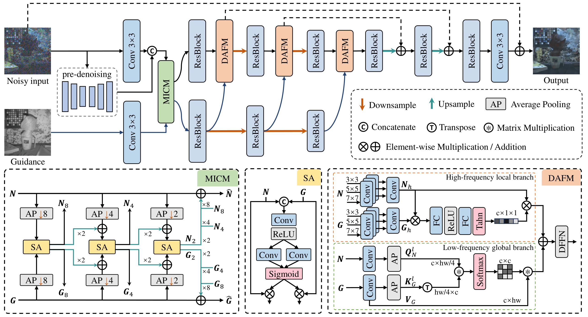

# RFFNet: Towards Robust and Flexible Fusion for Low-Light Image Denoising (ACM MM 2024)

Qiang Wang, Yuning Cui, Yawen Li, Yaping Ruan, Ben Zhu, [Wenqi Ren](https://scholar.google.com.hk/citations?user=VwfgfR8AAAAJ&hl=zh-CN&oi=ao)

[]()

## Abstract

>Low-light environments will introduce high-intensity noise into images. Containing fine details with reduced noise, near-infrared/flash images can serve as guidance to facilitate noise removal. 
However, existing fusion-based methods fail to effectively suppress artifacts caused by inconsistency between guidance/noisy image pairs and do not fully excavate the useful information contained in guidance images. In this paper, we propose a robust and flexible fusion network (RFFNet) for low-light image denoising. Specifically, we present a multi-scale inconsistency calibration module to address inconsistency before fusion by first mapping the guidance features to multi-scale spaces and calibrating them with the aid of pre-denoising features in a coarse-to-fine manner. Furthermore, we develop a dual-domain adaptive fusion module to adaptively extract useful high-/low-frequency signals from the guidance features and then highlight the informative frequencies.
Extensive experimental results demonstrate that our method achieves state-of-the-art performance on NIR-guided RGB image denoising and flash-guided no-flash image denoising.

## Network Architecture


## Installation
The project is built with PyTorch 3.8, PyTorch 1.8.1. CUDA 11.1, cuDNN 7.6.5
For installing, follow these instructions:
~~~
conda install pytorch=1.8.1 torchvision=0.9.1 -c pytorch
pip install requirements.txt
~~~

Train and Validation:
```bash
python train_RFFNet_DVD.py

python test.py
```

## Dataset Preparation
### DVD Dataset
Please download the public dataset from [DVD](https://drive.google.com/drive/folders/10FV0q_GAP4gjQUbQ78waezfyGO07AxlP?usp=share_link). 

Then, unzip the file into `dataset/DVD` directory.
And the directory structure is organized as:

```
DVD
├── train_raw
│     ├── RGB
│     ├── NIR
├── test
│     ├── RGB
│     ├── NIR
```

Finally, create the training patches for faster data loading by

`python generate_train_patches.py`

And the directory structure now is organized as:

```
DVD
├── train_raw
│     ├── RGB
│     ├── NIR
├── train
│     ├── RGB
│     ├── NIR
├── test
│     ├── RGB
│     ├── NIR
```
### FAID Dataset
Please download the public dataset from [FAID](http://yaksoy.github.io/faid/).

Then, unzip the file into `dataset/FAID` directory.
And the directory structure is organized as:

```
FAID
├── train
│     ├── Objects_001_ambient.png
│     ├── Objects_001_flash.png
│     ├── ...
├── test
│     ├── ...
```
`dataset/FAID/test_image_pairs.txt` and `dataset/FAID/val_image_pairs.txt` include the file names of the 256 test pairs and the file names of the 256 validation pairs respectively, following [RIDFnF](https://github.com/CGLab-GIST/RIDFnF). 

The other pairs were used for training our network.


## Train And Evaluation
```bash
conda create -name rffnet python=3.8

conda activate rffnet

pip install requirements.txt

python train_RFFNet_DVD.py

python test.py
```

## Citation
If you find this project useful for your research, please consider citing:
~~~
@inproceedings{wang2024rffnet,
  title={RFFNet: Towards Robust and Flexible Fusion for Low-Light Image Denoising},
  author={Wang, Qiang and Cui, Yuning and Li, Yawen and Ruan, Yaping and Zhu, Ben and Ren, Wenqi},
  booktitle={ACM Multimedia},
  year={2024}
}
~~~
## Acknowledgements
This repository is greatly inspired by [DVN](https://github.com/megvii-research/DVN).
